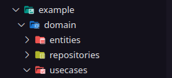
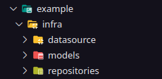
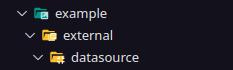
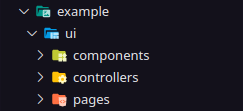
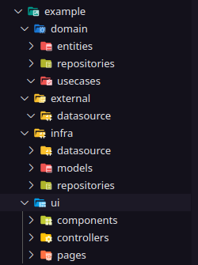
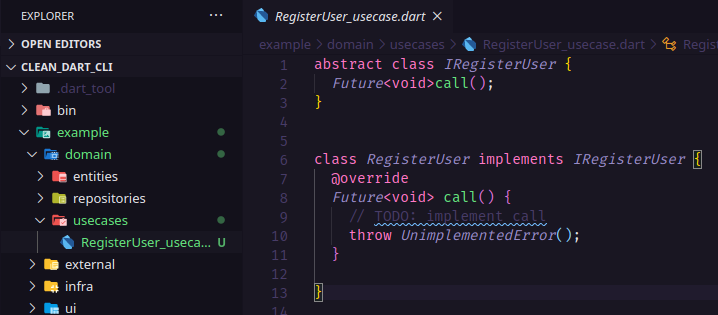
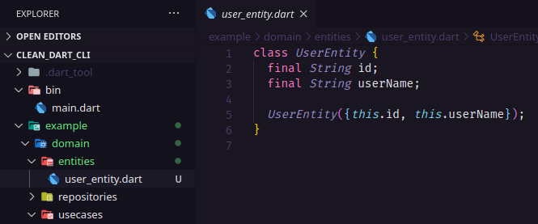
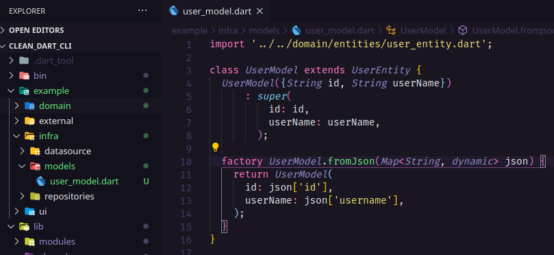
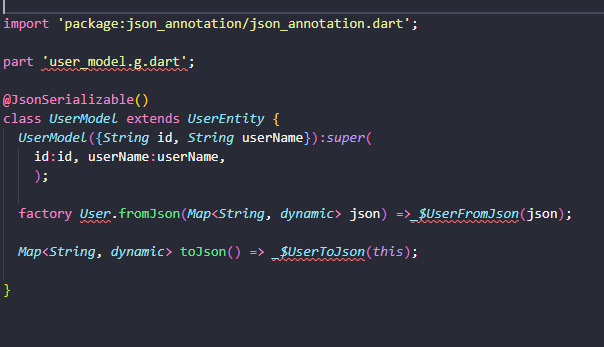
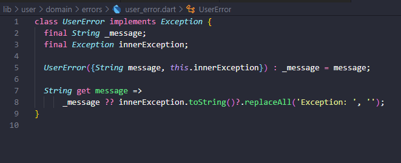

# Clean Dart CLI


This project is one cli for integrate Flutter and Dart with Clean Architecture

With this cli you can generate the structure of the folders based on the structure of the Clean Architecture and files like models, usecases and entites for automatize the time of the development.

## How to use?

First thing that you need to do is activate the clean-dart-cli, for this run the command bellow in your terminal

```dart
$ pub global activate --source git https://github.com/NitoBa/cli-cleandart.git
```

### Generate the layers folders

With clean-dart-cli you can generate all folders of the one specific layer

how to generate domain layer 

```dart
$ clean-dart gen layer domain /example
```



how to generate infra layer

```dart
$ clean-dart gen layer infra /example
```



how to generate external layer

```dart
$ clean-dart gen layer external /example
```



how to generate ui layer

```dart
$ clean-dart gen layer ui /example
```



how to generate complete layers

```dart
$ clean-dart gen layer complete /example
```



### Generate Files

how to generate usecases

```dart
$ clean-dart gen usecase /example/domain/usecases RegisterUser
```



how to generate entities

```dart
$ clean-dart gen entity /example/domain/entities User
```



how to generate models

```dart
$ clean-dart gen model /example/infra/models User
```




how to generate modelsJs (Model with Json Serializable)

```dart
$ clean-dart gen modelJs /user/external/models User
```




how to generate error

```dart
$ clean-dart gen error /user/domain/error User
```



## How to contribute?

You can clone this project and send a pull request with your improvements or open issues
